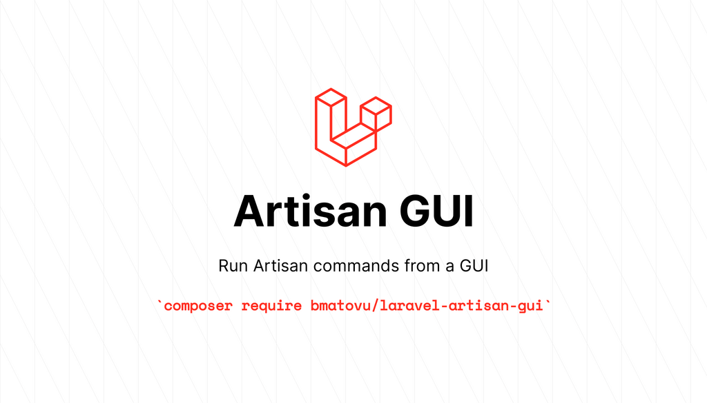
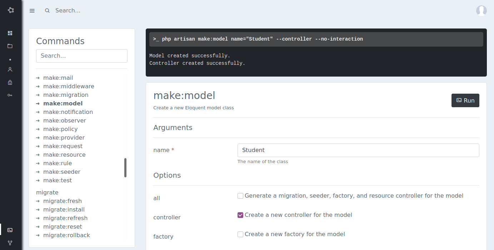

# Laravel Artisan GUI.

[](https://travis-ci.org/mtvbrianking/laravel-artisan-gui)
[](https://scrutinizer-ci.com/g/mtvbrianking/laravel-artisan-gui/?branch=master)
[](https://scrutinizer-ci.com/g/mtvbrianking/laravel-artisan-gui/?branch=master)
[](https://github.styleci.io/repos/230607368)
[](https://mtvbrianking.github.io/laravel-artisan-gui)



## [Installation](https://packagist.org/packages/bmatovu/laravel-artisan-gui)

Install via composer package manager:

```bash
composer require bmatovu/laravel-artisan-gui
```



## Usage

> This package uses [Vue](https://vuejs.org)  components.. These components also use the Bootstrap CSS framework. However, even if you are not using these tools, the components serve as a valuable reference for your own frontend implementation.

To publish the  Vue components, use the `vendor:publish` Artisan command:

```bash
php artisan vendor:publish --tag=artisan-gui-components
```

The published components will be placed in your `resources/js/components` directory. Once the components have been published, you should register them in your `resources/js/app.js` file:

```js
Vue.component(
    'artisan-gui-commander',
    require('./components/artisan-gui/Commander.vue').default
);
```

After registering the components, make sure to run `npm run dev` to recompile your assets. Once you have recompiled your assets, you may drop the components into one of your application's templates to get started creating clients and personal access tokens:

```html
<artisan-gui-commander/>
```
